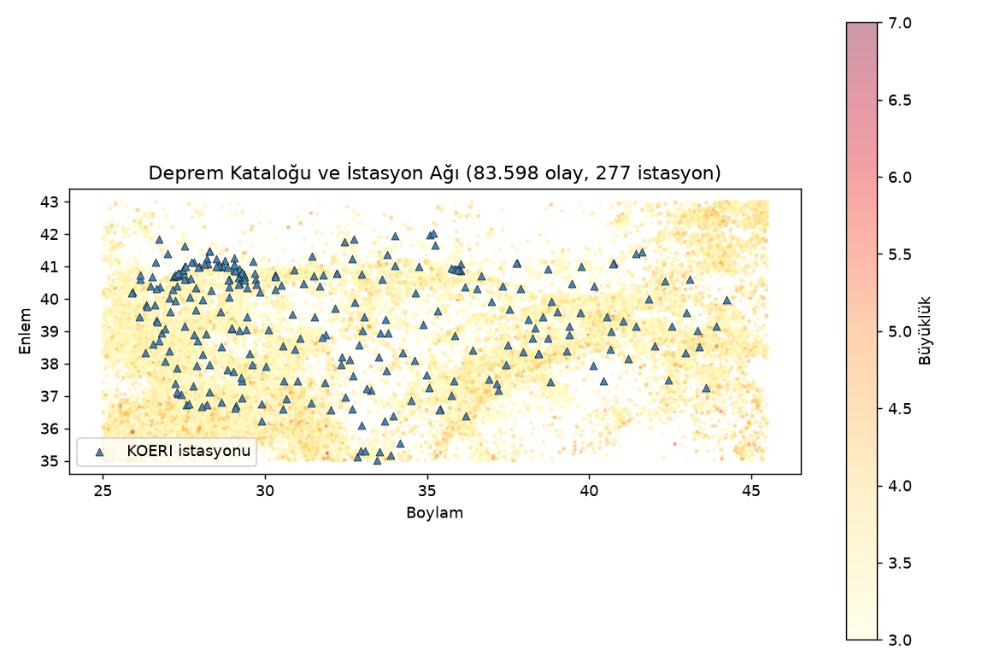
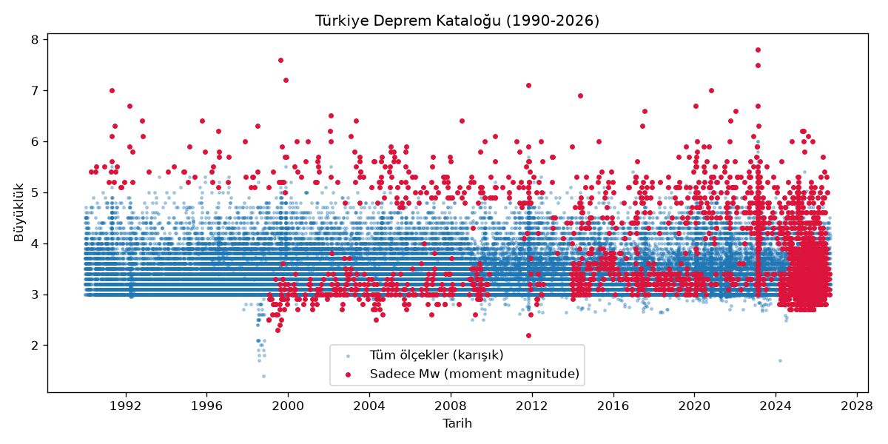
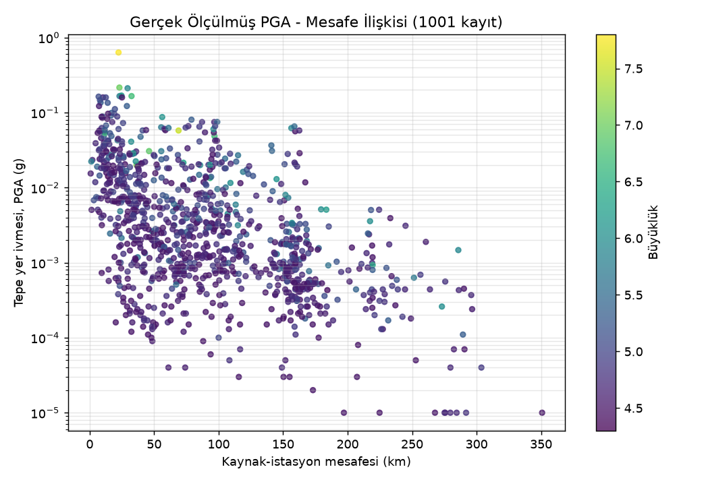
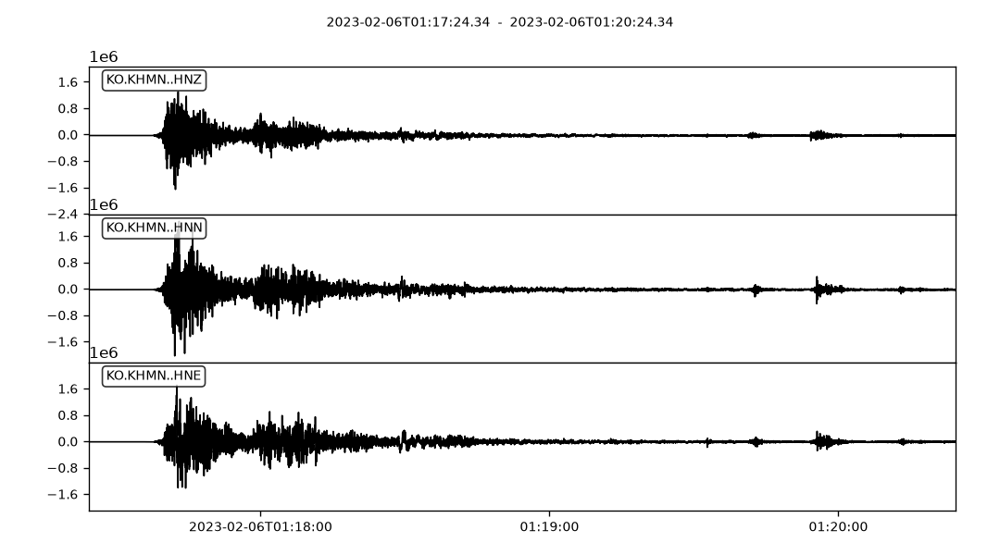

# Türkiye Deprem Verisi

Türkiye'ye özel deprem yapay zekası/makine öğrenmesi modelleri geliştirmek
isteyenler için, birden fazla açık kaynaktan derlenmiş, temiz ve
kullanıma hazır bir veri seti.

**Bu bir model değil, bir veri kaynağıdır.** Amaç: "büyüklük tahmini",
"erken uyarı", "sismik risk modeli" gibi kendi modelini eğitmek isteyen
herkesin, veri toplama/temizleme işini sıfırdan yapmasına gerek
kalmaması.

İşlenmiş veri (parquet/CSV/waveform dosyaları) ayrıca Hugging Face
Hub'da barındırılıyor, script'leri çalıştırmadan doğrudan indirebilirsiniz:
**[huggingface.co/datasets/Ayberkkr/turkiye-deprem-verisi](https://huggingface.co/datasets/Ayberkkr/turkiye-deprem-verisi)**

## Neden bu depo?

- STEAD gibi küresel veri setleri Türkiye'yi yeterince temsil etmiyor
  veya mühendislik açısından eksik (Vs30 bilgisi yok, ağırlıklı zayıf
  hareket verisi).
- Veriyi kaynak kaynak toplamak yerine, tek bir yerden, hazır
  birleştirilmiş ve dokümante edilmiş halde sunuyor.

## Veri kaynakları

| Kaynak | Lisans | Durum |
|---|---|---|
| USGS + EMSC + ISC (deduplike deprem kataloğu) | Public Domain / açık FDSN | Dahil, **84.100 benzersiz deprem** |
| KOERI / ORFEUS-EIDA (istasyon + dalga formu) | Açık FDSN | Dahil, 277 istasyon |
| USGS Global Vs30 Mosaic (zemin sınıfı) | Public Domain | Dahil, 277/277 istasyon |
| KOERI ham dalga formu (M≥4.5, genişletilmiş katalog) | Açık FDSN | Dahil, 5.413 dosya, 1.104 olay için |
| PGA/PGV/SNR/faz okuması + mühendislik öznitelikleri (Sa/Arias/CAV) + QC | Kendi hesaplamamız | Dahil |
| ISC uzman (analyst-reviewed) P/S pick'leri | ISC Bulletin | Dahil, 185 olay/384 pick, `isc_analyst_picks.csv` |
| Olay-istasyon tablosu (event-station) | Kendi hesaplamamız | Dahil, `event_station_table.csv` |
| ML benchmark bölmeleri (ground_motion/phase_picking/early_warning) | Kendi hesaplamamız | Dahil, `benchmarks/`, bkz. `docs/benchmarks.md` |

Detaylar için `DATA_CARD.md` ve `LICENSE-DATA.md` dosyalarına bakın.



## Kurulum

```bash
python3 -m venv venv
source venv/bin/activate   # Windows: venv\Scripts\activate
pip install -r requirements.txt
```

## Veriyi indirme (hazır, önerilen)

Script'leri çalıştırıp ~600MB veriyi ağdan yeniden üretmek yerine,
hazır işlenmiş halini Hugging Face Hub'dan doğrudan indirin:

```bash
pip install huggingface_hub
hf download Ayberkkr/turkiye-deprem-verisi --repo-type dataset --local-dir .
```

Bu, bu depodaki `data/processed/` ve `benchmarks/` klasörlerinin aynısını
indirir; kod/script'ler için hâlâ bu GitHub reposu gerekli.

## Veriyi yeniden üretme (kaynağından, opsiyonel)

Veriyi indirmek yerine sıfırdan (kendi API çağrılarınızla) üretmek
isterseniz, tek komutla sırayla:

```bash
bash scripts/run_all.sh
```

Ya da adım adım:

```bash
python scripts/download_usgs.py       # USGS deprem kataloğu (Türkiye)
python scripts/expand_catalog.py      # + EMSC/ISC ile genişletme ve deduplikasyon (84.100 olay)
python scripts/fetch_orfeus_eida.py   # KOERI istasyon listesi (+ --waveform ile örnek dalga formu)
python scripts/fetch_vs30.py          # istasyonlara zemin sınıfı (Vs30) ekler
python scripts/fetch_waveforms_bulk.py  # M>=4.5 depremler için gerçek dalga formu
python scripts/enrich_waveforms.py    # PGA/PGV/SNR/faz okuması, mühendislik öznitelikleri (Sa/Arias/CAV) ve QC hesaplar
python scripts/fetch_isc_picks.py     # ISC Bulletin'den uzman (analyst-reviewed) P/S pick'leri (opsiyonel)
python scripts/build_event_station_table.py  # her deprem-istasyon çifti için ayrı satır
python scripts/build_dataset.py       # hepsini birleştirip son veri setini üretir
python scripts/validate_dataset.py    # yayın öncesi bütünlük ve fiziksel tutarlılık kontrolü
python scripts/build_benchmarks.py    # ML görevleri için train/val/test bölmeleri (bkz. docs/benchmarks.md)
```

Sonuç: `data/processed/turkiye_deprem_veriseti_v3.parquet` + `data/processed/waveforms/` + `benchmarks/`

STEAD bilinçli olarak dahil edilmedi (bkz. `CHANGELOG.md`'deki "Bilinçli
olarak eklenmeyenler" bölümü). İsteyen `scripts/stead_kaggle_rehberi.md`
dosyasındaki adımları Kaggle'da takip edebilir.

## Kullanım örneği

```bash
python notebooks/01_baseline_example.py
python notebooks/make_readme_charts.py
```

`benchmarks/` klasöründeki resmi train/val/test bölmelerinin gerçekten
öğrenilebilir bir sinyal taşıdığını kanıtlayan basit bir referans model
(ek bağımlılık gerektirmez):

```bash
python notebooks/02_ground_motion_baseline.py
```

Detaylar ve güncel sonuç için `docs/benchmarks.md`.

Bu, veri setinin gerçekten çalıştığını kanıtlayan çıktılar üretir:





Yukarıdaki grafik, verinin fiziksel olarak tutarlı olduğunu gösteriyor:
kaynağa yakın ve büyük depremlerde PGA yüksek, uzaklaştıkça ve
küçüldükçe düşüyor (klasik azalım ilişkisi). Grafikteki her nokta,
`event_station_table.csv` içindeki tek bir deprem-istasyon çiftine
karşılık geliyor; yani PGA ve mesafe her zaman aynı istasyondan geliyor
(bkz. `docs/schema.md`).



Bu, 6 Şubat 2023 ana şokunun (M7.8) KO.KHMN istasyonundan gerçek ivme
kaydı.

## Lisans

Kod: MIT (`LICENSE`). Veri: kaynağa göre değişir, bkz. `LICENSE-DATA.md`.

## Katkıda bulunma

Yeni bir açık kaynak ekleyecekseniz lütfen önce `LICENSE-DATA.md`'ye
lisans uyumluluğunu kontrol edin (özellikle share-alike/copyleft
lisanslara dikkat). Kod değişikliği/test süreci için `CONTRIBUTING.md`'ye
bakın.
